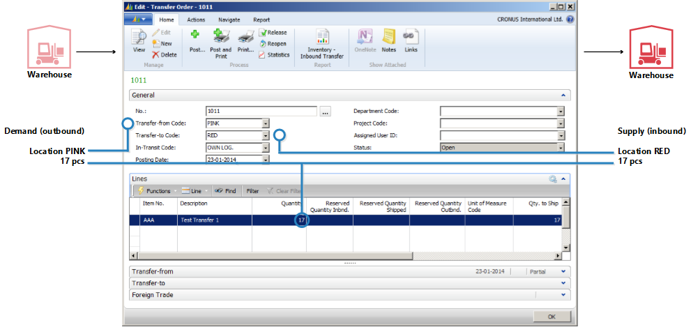
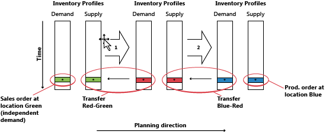
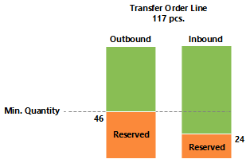
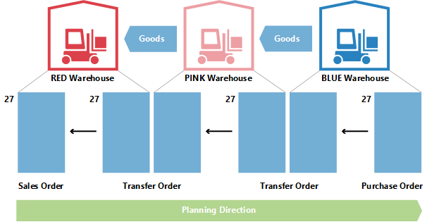
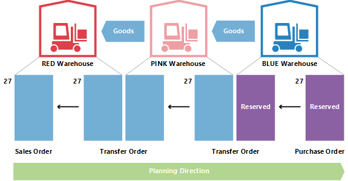
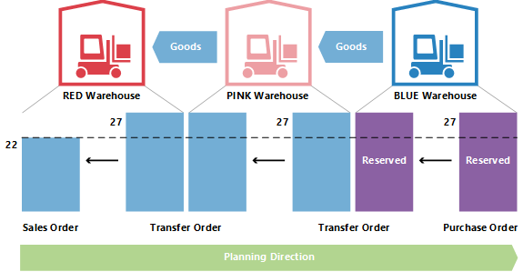
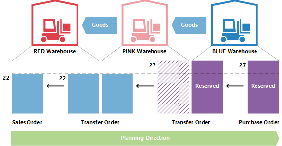
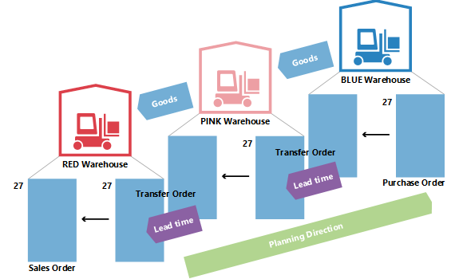

# Designdetails: Umlagerungen in der Planung
Umlagerungsaufträge sind ebenfalls eine Versorgungsquelle beim Arbeiten auf der Lagerhaltungsdatenebene. Wenn Sie "Mehrere Lagerorte (Lager)" verwenden, kann die Beschaffungsmethode auf Transfer festgelegt werden, damit der Lagerort aufgefüllt wird, indem Waren an einem anderen Lagerort übertragen werden. Sind mehrere Lager vorhanden, verfügen Unternehmen möglicherweise über eine Kette von Umlagerungen, in denen der Vorrat von GRÜN auf GELB und von GELB auf ROT usw. übergeht. Am Beginn der Kette steht ein Beschaffungssystem von Fertigungsauftrag oder Einkauf.  
  
  
  
Beim Vergleich mit der Situation, in der ein Beschaffungsauftrag direkt einem Bedarfsauftrag in einer Situation gegenübersteht, in der der Verkaufsauftrag durch eine Kette von Lagerhaltungsdaten-Übertragungen angegeben ist, ist es offensichtlich, dass die Planungsaufgabe in der letzteren Situation sehr komplex werden kann. Wenn sich der Bedarf ändert, kann dies zu einem Kaskadeneffekt durch die Kette führen, da alle Umlagerungsaufträge plus Kauf-/Fertigungsaufträge am anderen Ende der Kette geändert werden müssen, um die Balance zwischen Bedarf und Vorrat erneut herzustellen.  
  
  
  
## Warum ist Transfer ein spezieller Fall?  
Ein Umlagerungsauftrag sieht im Programm fast wie jeder andere Auftrag aus. Hinter den Kulissen ist es jedoch vollkommen anders.  
  
Ein grundlegender Aspekt, wodurch sich Umlagerungen beim Planen von Einkaufs- und Produktionsaufträgen unterscheiden, ist der Umstand, dass eine Umlagerungszeile Bedarf und Vorrat gleichzeitig darstellt. Der ausgehende Teil, der vom alten Lagerort geliefert wird, ist Bedarf. Der eingehende Teil, der am neuen Lagerort erhalten werden soll, ist Vorrat an diesem Lagerort.  
  
  
  
Das bedeutet, dass, wenn das System die Zugangsseite der Übertragung ändert, es eine ähnliche Änderung der Bedarfsseite vornehmen muss.  
  
## Umlagerungen sind abhängiger Bedarf  
Die zugehörige Bedarf und der Vorrat haben einige Ähnlichkeit mit Komponenten einer FA-Zeile, aber der Unterschied besteht darin, dass Komponenten auf der nächsten Planungsebene und mit einem anderen Artikel bestehen, während die beiden Teile der Umlagerung sich auf der gleichen Ebene für den gleichen Artikel befinden.  
  
Eine wichtige Ähnlichkeit besteht darin, dass der Umlagerungsbedarf so wie Komponenten abhängiger Bedarf ist. Der Bedarf aus einer Umlagerungszeile wird von der Bedarfsseite der Übertragung in dem Sinn festgelegt, dass, wenn der Vorrat geändert wird, der Bedarf direkt beeinflusst wird.  
  
Außer wenn die Planungsflexibilität "Keine" ist, sollte eine Umlagerungszeile nicht als unabhängiger Bedarf in der Planung behandelt werden.  
  
Im Planungsverfahren sollte der Übergangsbedarf nur berücksichtigt werden, nachdem die Bedarfsseite vom Planungssystem verarbeitet wurde. Davor ist der tatsächliche Bedarf nicht bekannt. Die Reihenfolge der vorgenommenen Änderungen ist daher für Umlagerungsaufträge sehr wichtig.  
  
## Planungssequenz  
Die folgende Abbildung zeigt, wie eine Folge von Umlagerungen aussieht.  
  
  
  
In diesem Beispiel bestellt ein Kunde den Artikel an Lagerort GRÜN. Lagerort GRÜN wird durch Umlagerung vom Zentrallager ROT angegeben. Das zentrale Lager ROT wird durch Umlagerung von der Produktion zu Lagerort BLAU beliefert.  
  
In diesem Beispiel beginnt das Planungssystem mit dem Kundenbedarf und arbeitet sich rückwärts durch die Kette. Die Bedarfe und Vorräte werden an einem Lagerort gleichzeitig verarbeitet.  
  
  
  
## Umlagerungsebenencode  
Die Reihenfolge, in der die Lagerorte im Planungssystem verarbeitet werden, wird durch der Übergangsebenencode der SKU bestimmt.  
  
Der Umlagerungsebenencode ist ein internes Feld, das automatisch in den Lagerhaltungsdaten berechnet und gespeichert wird, wenn Lagerhaltungsdaten erstellt oder geändert werden. Die Berechnung erfolgt über alle SKUs für eine angegebene Kombination aus Artikel/Variante und verwendet den Lagerortcode und den Umlagerung-von-Code, um die Route zu bestimmen, die die Planung verwenden muss, wenn sie die SKUs durchläuft, um sicherzustellen, dass alle Bedarfe verarbeitet werden.  
  
Der Umlagerungsebenencode ist 0 für Lagerhaltungsdaten mit der Beschaffungsmethode"Einkauf" oder "Fertigungsauftrag" und -1 für die erste Umlagerungsebene, -2 für die zweite Umlagerungsebene usw. In der Übergangskette, die oben beschrieben wurde, würden die Ebenen daher -1 für ROT und -2 für GRÜN ein, wie in der folgenden Abbildung angezeigt.  
  
  
  
Bei der Aktualisierung der Lagerhaltungsdaten erkennt das Planungssystem, ob Lagerhaltungsdaten mit der Beschaffungsmethode Transfer mit Zirkelverweisen eingerichtet werden.  
  
## Planungsübertragungen ohne Lagerhaltungsdaten  
  
Selbst wenn die SKU-Funktion nicht verwendet wird, ist es möglich, Lagerorte zu verwenden und manuelle Umlagerungen zwischen Lagerorten vorzunehmen. Für Unternehmen mit weniger fortschrittlichen Logistik Einrichtungen unterstützt das Planungssystem Szenarien, in denen vorhandener Lagerbestand manuell an einen anderen Lagerort übertragen wird, beispielsweise um einen Verkaufsauftrag an diesem Lagerort abzudecken. Gleichzeitig sollte das Planungssystem auf Änderungen im Bedarf reagieren.  
  
Um manuelle Übertragungen zu unterstützen, analysiert die Planung vorhandene Umlagerungsaufträge und plant dann die Reihenfolge, in der die Lagerorte bearbeitet werden sollen. Intern arbeitet das Planungssystem mit den temporären SKUs, die Übergangsebenencodes tragen.  
  
  
  
Wenn mehr Umlagerungen zu einem bestimmten Lagerort vorhanden sind, definiert der erste Umlagerungsauftrag die Planungsrichtung. Umlagerungen, die in die entgegengesetzte Richtung ausgeführt werden, werden storniert.  
  
## Ändern der Menge mit Reservierungen  
Wenn Mengen in vorhandenem Vorrat geändert werden, berücksichtigt das Planungssystem Reservierungen im dem Sinn, dass die reservierte Menge die Untergrenze dafür darstellt, um wie viel der Vorrat reduziert werden kann.  
  
Wenn Sie die Menge auf einer bestehenden Umlagerungszeile ändern, beachten Sie, dass die Untergrenze als die höchste reservierte Menge der ausgehenden und der eingehenden Umlagerungsauftragszeile definiert ist.  
  
Wenn beispielsweise eine Umlagerungsauftragszeile von 117 Stück gegen eine Verkaufszeile von 46 und eine Einkaufszeile von 24 reserviert wird, ist es nicht möglich, die Umlagerungszeile unter 46 Stück zu verringern, auch wenn dies möglicherweise überschüssigen Vorrat für die jeweilige eingehende Seite bedeuten würde.  
  
  
  
## Ändern der Menge in einer Umlagerungskette  
Im folgenden Beispiel ist der Ausgangspunkt eine ausgeglichene Situation mit einer Übergangskette, die einen Verkaufsauftrag von 27 an Lagerort ROT mit einer entsprechenden Bestellung am Lagerort BLAU bereitstellt, umgelagert über Lagerort ROSA. Daher gibt es, abgesehen von Verkauf und Einkauf, es zwei Umlagerungsaufträge: BLAU-ROSA und ROSA-ROT.  
  
  
  
Jetzt beschließt der Planer am Lagerort PINK, gegen den Einkauf zu reservieren.  
  
  
  
Dies bedeutet normalerweise, dass das Planungssystem die Einkaufsbestellung und den Übergangsbedarf ignoriert. Solange es Saldo gibt, gibt es kein Problem. Was geschieht aber, wenn der Kunde am Standort ROT teilweise seinen Auftrag bedauert und ihn zu 22 ändert?  
  
  
  
Wenn das Planungssystem erneut ausgeführt wird, sollte es überschüssigen Vorrat loswerden. Jedoch sperrt die Reservierung den Einkauf und die Übertragung zu einer Menge von 27.  
  
  
  
Die ROSA-ROTE Umlagerung wird auf 22 reduziert. Der eingehende Teil der BLAU-ROSA Umlagerung wird nicht reserviert, weil der ausgehende Teil reserviert wird, ist es nicht möglich, die Menge unter 27 zu verringern.  
  
## Beschaffungszeit  
Wenn das Fälligkeitsdatum eines Umlagerungsauftrags berechnet wird, werden verschiedene Arten von Beschaffungszeit berücksichtigt.  
  
Die Durchlaufzeiten, die aktiv sind, wenn ein Umlagerungsauftrag geplant ist, sind:  
  
* Ausgeh. Lagerdurchlaufzeit  
* Transportzeit  
* Eingeh. Lagerdurchlaufzeit  
* In der Planungszeile werden die folgenden Felder verwendet, um Informationen über die Berechnung bereitzustellen.  
* Umlagerungsausgangsdatum  
* Startdatum  
* Enddatum  
* "Fälligkeitsdatum"  
  
Das Lieferdatum der Umlagerungszeile wird im Feld „Umlagerungslieferdatum“, und das Wareneingangsdatum der Umlagerungszeile wird im Feld „Fälligkeitsdatum“ angezeigt.  
  
Das Start- und Enddatum werden verwendet, um die tatsächliche Transportperiode zu beschreiben.  
  
Die folgende Abbildung zeigt die Interpretation von Startdatum/-zeit und Enddatum/-zeit auf Planungszeilen im Zusammenhang mit Umlagerungsaufträgen.  
  
  
  
In diesem Beispiel bedeutet dies, dass:  
  
* Warenausg.-Datum + Ausgehende Verarbeitung = Startdatum  
* Startzeit + Transportzeit = Endzeit  
* Enddatum + Eingehende Lagerdurchlaufzeit = Wareneingangsdatum  
  
## Sicherh.-Zuschl. Beschaff.-Zt.  
Das Feld „Vorg. Sich.-Zuschl. Besch.-Zt.“ im Fenster „Fertigungseinrichtung“ und das zugehörige Feld „Sicherh.-Zuschl. Beschaff.-Zt.“ auf der Artikelkarte werden nicht in der Berechnung eines Umlagerungsauftrags berücksichtigt. Die Sicherheitsbeschaffungszeit beeinflusst jedoch den Gesamtplan wie den Beschaffungsauftrag (Einkauf oder Produktion) am Anfang der Übertragungskette, wenn die Artikel an den Lagerort verbracht werden, von dem aus sie umgelagert werden sollen.  
  
  
  
In der FA-Zeile gilt: Enddatum + Sicherheitszuschlag Beschaffungszeit + Eingehende Lagerdurchlaufzeit = Fälligkeitsdatum.  
  
In der Bestellzeile gilt: Geplantes Wareneingangsdatum + Sicherheitszuschlag Beschaffungszeit + Eingehende Lagerdurchlaufzeit = Erwartetes Wareneingangsdatum.  
  
## Neu berechnen  
Wenn eine vorhandene Umlagerungszeile neu geplant wird, muss das Planungssystem den ausgehenden Teil suchen und desssen Datum/Zeit ändern. Es ist wichtig zu wissen, dass nach der Definition der Beschaffungszeit eine Lücke zwischen Lieferung und Eingang besteht. Wie erwähnt, kann die Beschaffungszeit aus mehr Elementen, wie Transportzeit und Lagerdurchlauf, bestehen. In einer Zeitachse geht das Planungssystem in der Zeit zurück, während es die Elemente ausgleicht.  
  
  
  
Daher muss, wenn des Fälligkeitsdatum auf einer Umlagerungszeile geändert wird, die Beschaffungszeit berechnet werden, um die ausgehende Seite der Übertragung zu aktualisieren.  
  
## Serien-/Chargennummern in Übergangsketten  
Wenn der Bedarf Serien-/Chargennummern trägt und das Planungsmodul ausgeführt wird, führt dies zu einigen direkt erstellten Umlagerungsaufträgen. Weitere Informationen zu diesem Konzept finden Sie unter Artikel-Attribute. Werden jedoch Serien-/Chargennummern vom Bedarf entfernt, haben die erstellten Umlagerungsaufträge in der Kette noch die Serien-/Chargennummern und werden daher bei der Planung ignoriert (nicht gelöscht).  
  
## Auftrag-zu-Auftrag-Verknüpfungen  
In diesem Beispiel wird die BLAUE SKU mit dem Auftragswiederbeschaffungsverfahren eingerichtet, während ROSA und ROT Los-für-Los verwenden. Wenn ein Verkaufsauftrag von 27 in Lagerort ROT erstellt wird, führt er zu einer Kette von Umlagerungen, wobei das letzte Gelenk am Standort BLAU mit Bindung reserviert wird. In diesem Beispiel sind die Reservierungen nicht harte Reservierungen, die vom Planer am ROSA Lagerort erstellt wurden, sondern Bindungen, die vom Planungssystem erstellt wurden. Die wichtige Unterschied besteht darin, dass das Planungssystem die letzteren ändern kann.  
  
  
  
Wenn Bedarf von 27 zu 22 geändert wird, senkt das System die Menge durch die Kette hindurch ab, wobei auch die Bindungsreservierung reduziert wird.  
  
## Siehe auch  
[Designdetails: Planungsparameter](design-details-planning-parameters.md)   
[Designdetails: Planungs-Zuordnungstabelle](design-details-planning-assignment-table.md)   
[Designdetails: Umgang mit Wiederbeschaffungsverfahren](design-details-handling-reordering-policies.md)   
[Designdetails: Bedarf an leerem Lagerort](design-details-demand-at-blank-location.md)   
[Designdetails: Zentrale Konzepte des Planungssystems](design-details-central-concepts-of-the-planning-system.md)   
[Designdetails: Ausgleich von Bedarf und Vorrat](design-details-balancing-demand-and-supply.md)   
[Designdetails: Vorratsplanung](design-details-supply-planning.md)
